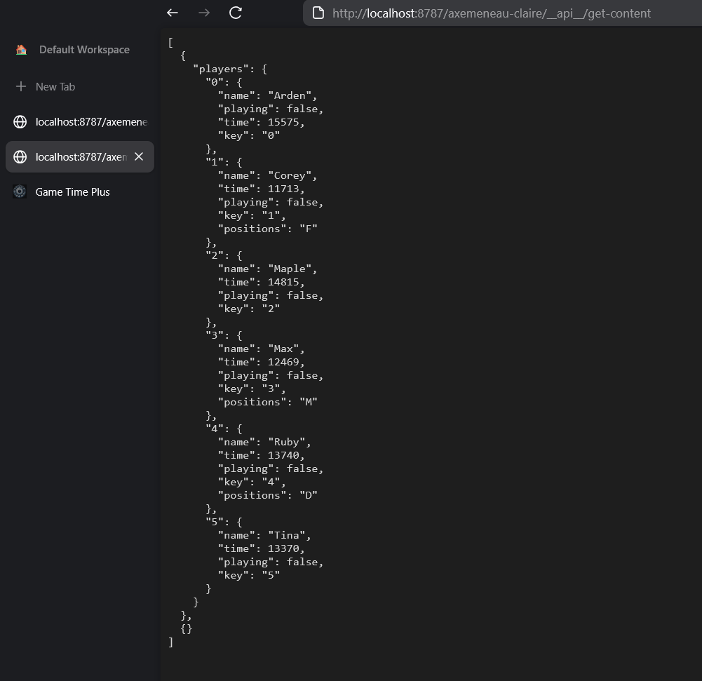
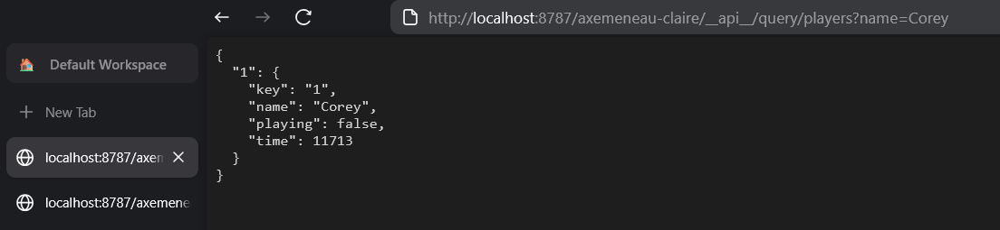

# Game Time Plus

A Local First Next.js application to track the play time of players on a team - with TinyBase for state management and real-time synchronization.

**[🚀 Live Demo: https://game-time-plus-next.vercel.app](https://game-time-plus-next.vercel.app)**

## Demo Video

https://github.com/user/game-time-plus-next/assets/video/demo.mp4

## Project Structure

This project is set up as a monorepo with the following packages:

- `packages/game-time-plus` - The main Next.js application
- `packages/tinybase-server` - WebSocket server for TinyBase synchronization

## TinyBase Implementation

This project uses TinyBase for managing team and player data with both local storage persistence and real-time synchronization. The implementation includes:

- A TinyBase mergeable store for teams and players data
- Local storage persistence for offline capability
- WebSocket synchronization for real-time collaboration
- Custom React hooks for easy integration with components

### Key Files

- `packages/game-time-plus/src/hooks/useTeamsStore.ts` - Custom React hook for using the teams store with local persistence
- `packages/game-time-plus/src/components/Store.tsx` - Provider component for TinyBase store with WebSocket synchronization
- `packages/game-time-plus/src/components/TeamNameForm.tsx` - Example component using the TinyBase store
- `packages/game-time-plus/src/components/Players.tsx` - Component for managing player data
- `packages/tinybase-server/ws-server.ts` - WebSocket server implementation for TinyBase synchronization

### Features

The application demonstrates how to use TinyBase to:

1. Add and delete team names with city information
2. Navigate to team-specific pages
3. Persist data between page refreshes using localStorage
4. Synchronize data in real-time across multiple clients
5. Manage player information for teams

## API

Game Time Plus includes a powerful API for accessing and manipulating team and player data.



The API supports complex queries to filter and retrieve specific data:



## Getting Started

First, install dependencies and run the development server:

```bash
# Install dependencies
pnpm install

# Start the development server
pnpm dev
```

Open [http://localhost:3000](http://localhost:3000) with your browser to see the result.

## Environment Variables

The application requires the following environment variables:

```
# TinyBase WebSocket server URL
NEXT_PUBLIC_TINYBASE_SERVER_URL=ws://localhost:8787
```

An example `.env` file is provided in `packages/game-time-plus/.env.example`.

## Learn More

To learn more about the technologies used in this project:

- [Next.js Documentation](https://nextjs.org/docs)
- [TinyBase Documentation](https://tinybase.org/docs)
- [TinyBase UI React](https://tinybase.org/docs/ui/react)
- [TinyBase Synchronizers](https://tinybase.org/docs/sync/synchronizers)

## Deployment

The Next.js application can be deployed on [Vercel](https://vercel.com/new) and the TinyBase server can be deployed on [Cloudflare Workers](https://workers.cloudflare.com/).
